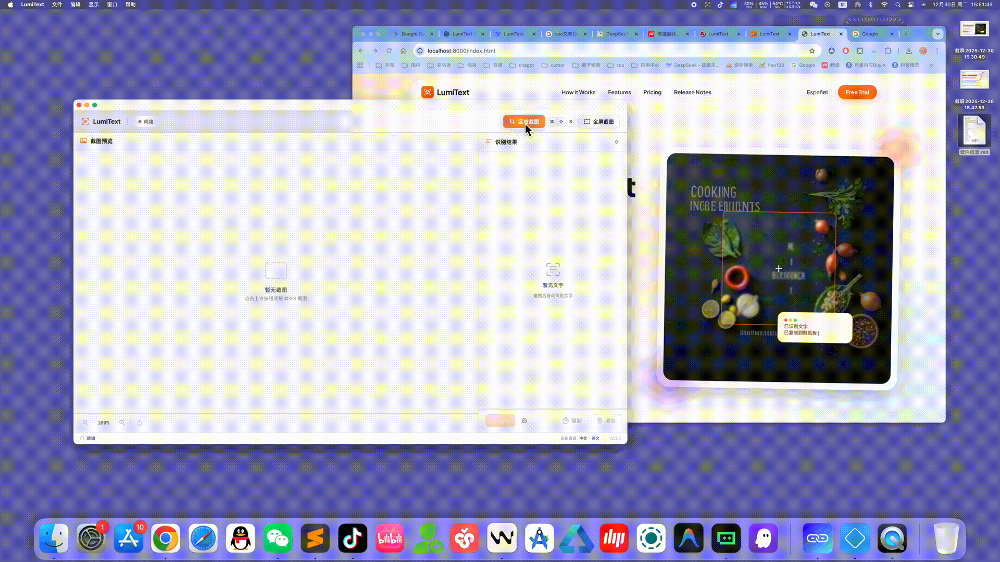
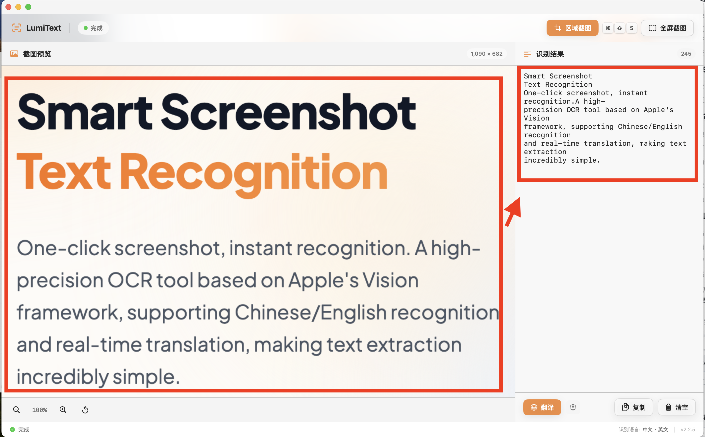

<p align="center">
  
</p>

<h3 align="center">LumiText</h3>

<p align="center">
  <strong>macOS 智能截图文字识别与翻译工具</strong>
</p>

<p align="center">
  <a href="#-安装方式"></a>
  <a href="#-系统要求"></a>
  <a href="LICENSE"></a>
  
</p>

<p align="center">
  <a href="README.md">English</a> | 简体中文 | <a href="README.ja.md">日本語</a> | <a href="README.fr.md">Français</a> | <a href="README.es.md">Español</a> | <a href="README.pt.md">Português</a> | <a href="README.de.md">Deutsch</a>
</p>

---

## 🎯 关于 LumiText

LumiText 是一款轻量强大的 **macOS 效率工具**。它能帮你从屏幕任意位置——图片、PDF、视频、网页、甚至暂停的视频画面——提取文字，并即时识别、翻译、复制。告别手动打字，所有处理都在你的 Mac 本地完成。

### ✨ 核心功能

- **📸 截图识字** — 按下快捷键，框选屏幕任意区域，文字即可自动识别并复制到剪贴板。支持全屏截图和精确区域选择。
- **🌍 多语言 OCR** — 支持中文（简/繁体）、英文、日文、韩文、法文、德文、西班牙文、葡萄牙文、俄文、阿拉伯文等多语种识别。自动检测语言，无需手动切换。
- **🔄 即时翻译** — 识别文字一键翻译成多种语言，原文和译文自由切换。
- **📱 扫码识别** — 支持 QR 码、Aztec、DataMatrix、PDF417、Code128、Code39、EAN13、EAN8 等多种码制，直接从屏幕识别。

<p align="center">
  
</p>

---

## 🏆 为什么选择 LumiText？

**⚡ 高速性能**
macOS 原生开发，充分发挥 Apple Silicon（M1/M2/M3/M4）芯片性能，实现毫秒级文字识别。无需等待云端响应，本地处理即刻完成。

**🔒 隐私安全**
所有 OCR 处理均在 Mac 本地完成。你的截图和识别内容永远不会离开设备。核心功能完全离线可用，无需联网。

**🎯 简洁无扰**
安静驻留在菜单栏，通过全局快捷键随时唤醒。识别结果自动复制，无需复杂设置，上手即用。

**🌐 30 种界面语言**
完整国际化支持，涵盖中文、英文、日文、韩文、法文、德文、西班牙文、葡萄牙文、阿拉伯文等 30 种界面语言。App 自动适配系统语言。

<p align="center">
  
</p>

---

## 📋 适用场景

| 场景 | LumiText 如何帮你 |
|------|------------------|
| 💼 办公处理 | 从会议幻灯片、扫描文档、图表报告中快速提取文字。 |
| 🎓 学术研究 | 摘录论文内容，提取图表数据，高效整理参考文献。 |
| 📚 查阅外文 | 浏览外文网站、论文，观看带字幕视频，即时翻译。 |
| 🎨 内容创作 | 从设计稿、截图、视觉素材中获取文字，无需手动输入。 |
| 📖 语言学习 | 阅读时随时识别生僻字，获取即时翻译。 |
| 💻 编程开发 | 复制终端输出、报错信息、文档截图中的文字。 |

---

## 🚀 使用方法

**① 按 ⌘ ⇧ S** — 在浏览器、PDF 阅读器、视频播放器或任意应用中随时唤醒。

**② 框选区域** — 拖动鼠标选择文字区域，支持全屏或精确截取。

**③ 粘贴使用** — 文字自动复制，按 ⌘V 粘贴到任意应用。

---

## 📥 安装方式

### Mac App Store（推荐）

[](https://apps.apple.com/us/app/lumitext-ocr%E6%88%AA%E5%9B%BE%E8%AF%86%E5%88%AB%E4%B8%8E%E7%BF%BB%E8%AF%91/id6758448720?l=zh-Hans-CN&mt=12)

> **提示：** 在 Mac App Store 中搜索"LumiText"，或点击上方按钮直接下载。

### 系统要求

| 要求 | 详情 |
|------|------|
| **系统** | macOS 12.0 (Monterey) 及以上 |
| **处理器** | Apple Silicon (M1 / M2 / M3 / M4) 或 Intel Mac |
| **权限** | 屏幕录制、辅助功能 |

---

## 🎯 快速入门指南

1. **📲 下载安装** — 从 Mac App Store 获取 LumiText
2. **🔐 授权权限** — 首次启动时，在系统偏好设置中授予"屏幕录制"和"辅助功能"权限
3. **⌨️ 开始使用** — 按 `⌘⇧S` 随时从任意应用激活 LumiText

### 快捷键一览

| 快捷键 | 功能 |
|--------|------|
| `⌘⇧S` | 截图 OCR 识别 |
| `⌘⇧V` | 剪贴板历史 |
| `⌘⇧T` | 切换翻译 |

---

## 🔍 关键词 & SEO

```
OCR, 文字识别, 截图识别, macOS工具, 效率软件,
macOS效率工具, 隐私安全OCR, 离线文字识别,
Apple Silicon优化, 本地处理, 翻译工具,
多语言识别, 截图转文字, 图片文字提取,
二维码扫描, 条形码读取, 菜单栏应用, Mac实用工具,
文档数字化, 图片转文字转换器
```

---

## 🤝 参与贡献

发现 Bug 或有功能想法？请使用模板提交 Issue：

- [🐛 问题反馈](https://github.com/lumitext/lumitext/issues/new?template=bug_report.md)
- [✨ 功能建议](https://github.com/lumitext/lumitext/issues/new?template=feature_request.md)

详见 [CONTRIBUTING.md](CONTRIBUTING.md) 贡献指南。

---

## 📄 许可证

本项目基于 MIT 许可证开源 - 详见 [LICENSE](LICENSE) 文件。

---

## 🔒 安全说明

安全相关问题请参阅 [SECURITY.md](SECURITY.md)。

---

<p align="center">
  <sub>© 2026 LumiText — 你的屏幕，你的文字，你的隐私</sub>
</p>
